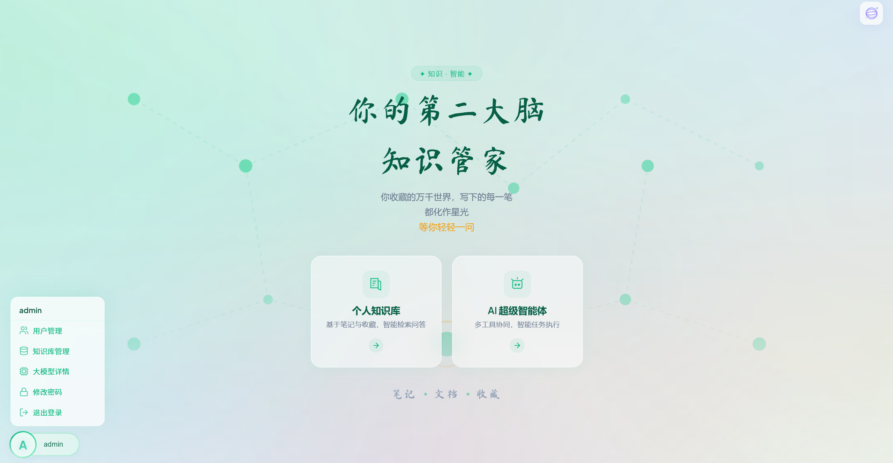
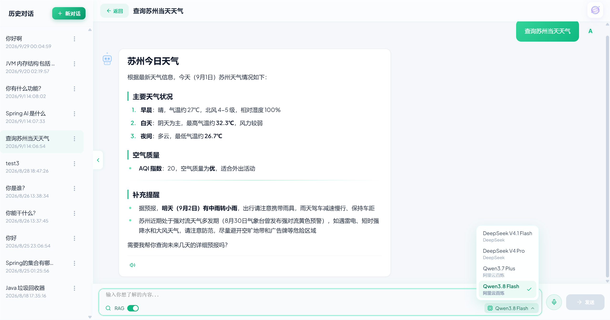
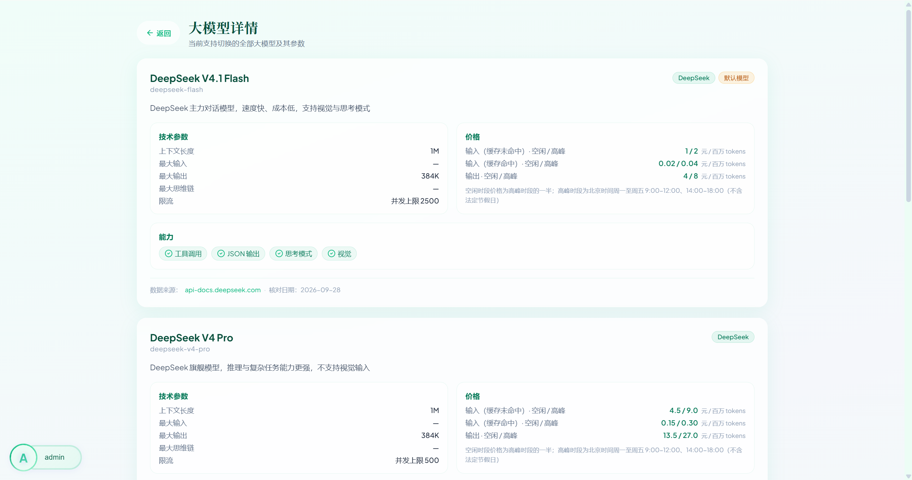
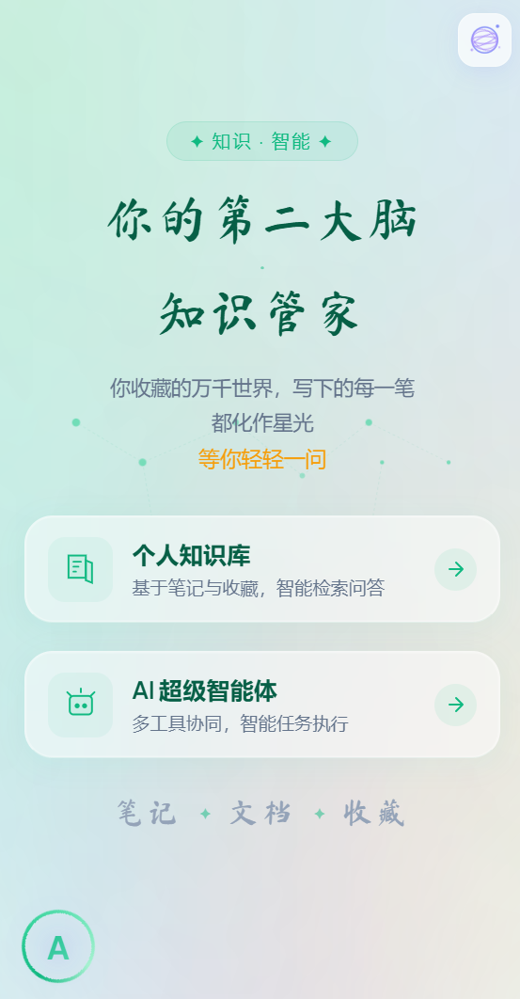
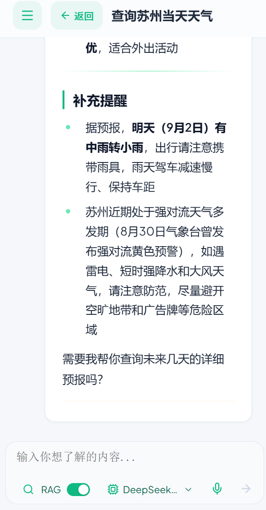
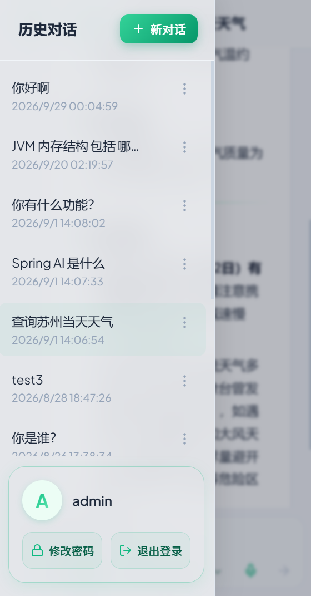
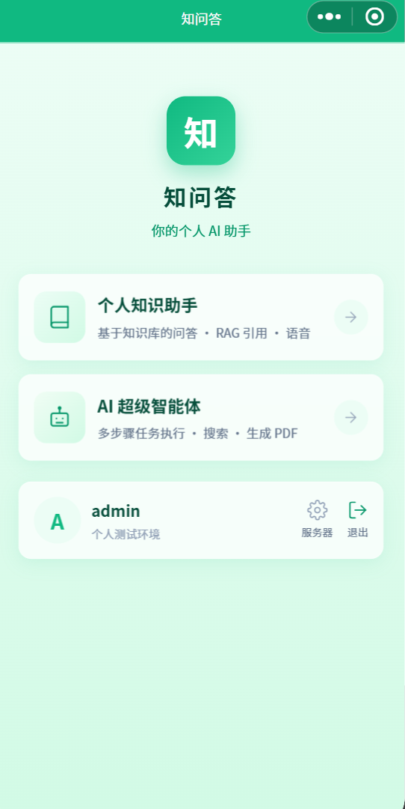
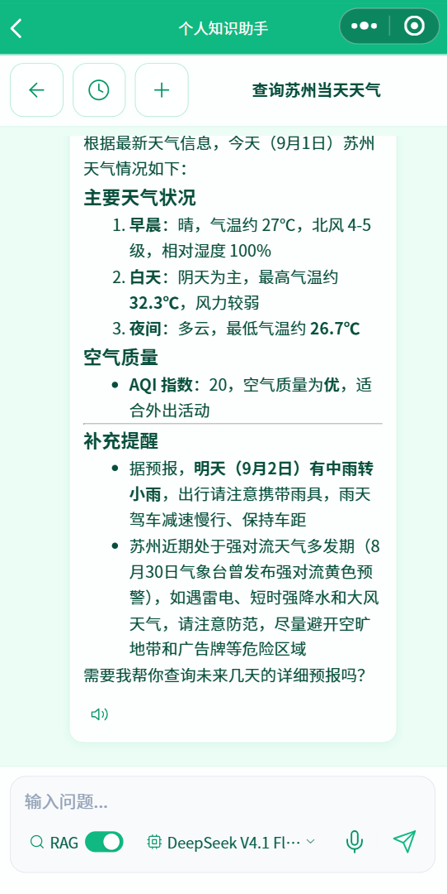

# AI Agent 智能代理平台

基于 **Spring Boot 3.5.10 + Java 17 + Vue 3** 的全栈 AI 智能代理平台。**对话模型 4 个可切**（DeepSeek V4.1 Flash / V4 Pro、Qwen3.7 Plus / 3.8 Flash，清单见 `constant/ChatModelCatalog`），**向量模型使用阿里云百炼 DashScope（qwen-plus）**，支持 ReAct 模式 Agent、RAG 知识库检索、多会话聊天记忆，以及多种工具调用。

---

## ✨ 功能特性

| 功能 | 说明 |
|------|------|
| 🤖 **AI 超级智能体** | ReAct 模式 Agent，支持多步推理和工具调用（文件操作、网页搜索、PDF 生成、资源下载等） |
| 🧠 **个人知识助手** | 多源知识融合问答，基于 RAG 检索笔记与收藏，支持流式对话、引用标注和切片展示 |
| 📚 **RAG 知识库 + 引用标注** | MongoDB 向量库（自研 MongoVectorStore，应用层余弦检索），AI 回复标注来源编号 `[1]`、`[2]`，展开查看原文切片 |
| 🔄 **引用持久化** | 引用数据随消息持久化到 MongoDB，刷新页面不丢失 |
| 🧠 **双模型架构** | 对话用 DeepSeek【@Qualifier("openAiChatModel")】，向量化用千问 Qwen-Plus（DashScope）【@Qualifier("dashscopeEmbeddingModel")】 |
| 🔀 **多模型切换 + 模型展示页** | 4 个可切对话模型（DeepSeek V4.1 Flash / V4 Pro、Qwen3.7 Plus / 3.8 Flash），聊天输入框左下角下拉直接切；**切换后上下文连续**（记忆按会话存取，与模型无关）；个人中心「大模型详情」进入 `/models`，展示各模型参数 / 价格 / 能力（标注官方来源与核对日期）；**三端可用**（Web 直接实现，安卓随 H5 生效，小程序独立实现） |
| 💬 **聊天记忆** | MongoDB 持久化聊天记录，支持历史会话管理和知识库检索开关 |
| 🖼 **图片搜索与展示** | 联网图片搜索，统一图片代理服务（ImageProxyService）绕过防盗链，前端聊天内直接显示；硬防盗链素材站黑名单过滤 |
| 📄 **PDF 含图生成** | PDF 支持嵌入图片（Markdown 图片语法），图片下载走图片代理服务（多策略 Referer），统一缩放 |
| 🔗 **工作流引擎** | SPEL 表达式驱动的多步骤工具编排，支持预设工作流（pdf_report、image_album），由 LLM 根据场景自动触发 |
| 🛡 **统一异常降级** | 基于 AOP 注解的统一降级框架，支持重试、缓存、跳过、通知、备选五种降级策略 |
| 🔒 **登录鉴权** | JWT Token 认证，支持注册/登录/密码修改，注册含图片验证码校验；启动时随机生成密钥，重启后旧 token 自动失效 |
| 👥 **用户管理（管理员）** | 管理员专属页面（个人中心下拉进入）：列表展示用户名 / 用户ID / 权限 / 注册时间 / 最后登录 / 更新时间，支持用户名搜索、排序与分页（每页 10 条）；批量勾选授予或取消管理员，禁止修改自己的权限且保证至少保留一个管理员，权限变更即时生效 |
| 🎨 **现代化 UI** | 翠绿主题玻璃拟态风格，Lucide 统一图标库，流式 Markdown 渲染，RAG 来源知识卡片，移动端自适应，密码显示/隐藏切换 |
| 🗂 **历史对话管理** | 侧边栏标题"历史对话"；每个会话三点菜单（批量管理/修改标题/删除对话），修改标题为弹窗交互，**批量管理**支持多选批量删除（空心圆勾选 + 底部取消/删除(N)按钮条 + 删除确认弹窗，移动端/桌面端同一套排版） |
| 🎙 **AI 回复语音播报（TTS）** | 接入百炼 CosyVoice 语音合成，AI 回复一键语音播报，长文本自动分段合成，按内容 MD5 文件缓存（重复内容秒级返回） |
| 🎤 **麦克风语音输入（STT）** | 输入框麦克风按钮录音（Web Audio 降采样编码 WAV），接入百炼 Paraformer 实时识别，转写结果填入输入框，Ctrl+Enter 换行 |
| 🖼 **图片点击放大预览** | 点击 AI 回复图片全屏放大（背景虚化 blur），消息区事件委托实现（DOMPurify 会剥离内联事件属性）；已取消长按保存交互 |
| 👤 **移动端个人信息卡片** | 知识库聊天页移动端侧边栏底部：圆形头像 + 用户名 + 修改密码/退出登录（复用网页端图标与登出逻辑） |
| 📱 **安卓 APP** | 轻量 WebView 壳（`android/` 独立 Gradle 工程，Kotlin 自研，无第三方框架），远程加载已部署 H5，支持服务器地址配置（内网穿透域名可改）、PDF 等文件原生下载与分享、录音输入 |
| 🧩 **微信小程序端** | uni-app CLI + Vite（`miniprogram/` 独立工程，Vue3 语法编译到微信小程序）：应用中心首页（知识助手 / AI 超级智能体双入口）、流式聊天（RAG 开关 + 引用折叠展示 + **多模型切换**）、历史会话管理（切换/改标题/删除/批量删除）、语音输入（STT）/播报（TTS）、图片下载本地化显示与点击预览、PDF 下载打开、服务器地址可配置 |

---

## 📸 界面预览

**Web 端**（翠绿主题玻璃拟态）







**Web 端管理页**（仅管理员可见）


**安卓 APP**（WebView 壳，加载已部署 H5）

 



**微信小程序**（uni-app 编译，真机运行）

 


---

## 🏗 技术栈

### 后端

| 技术 | 版本 | 用途 |
|------|------|------|
| Java | 17 | 开发语言 |
| Spring Boot | 3.5.10 | 应用框架 |
| Spring AI | 1.0.0-M6 | AI 模型统一调用（OpenAI 兼容接口 + DashScope） |
| DashScope SDK | 2.18.5 | 阿里云百炼（向量化模型） |
| MongoDB | - | 聊天记忆 + 向量库（自研 MongoVectorStore，集合 `vector_store`） |
| JWT (jjwt) | 0.12.6 | 登录鉴权（启动时随机生成签名密钥） |
| iText Core + font-asian | 9.1.0 | PDF 生成（嵌入微软雅黑中文字体） |
| jsoup | 1.19.1 | 网页抓取 |
| Hutool | 5.8.5 | Java 工具库 |
| Spring AOP | - | 统一降级注解（@Degradable） |
| Knife4j | 4.4.0 | API 文档 |

### 前端

| 技术 | 版本 | 用途 |
|------|------|------|
| Vue 3 | 3.5.x | 前端框架 |
| Vite | 5.4.x | 构建工具 |
| Vue Router | 4.4.x | 路由 |
| Axios | 1.7.x | HTTP 请求 |
| @lucide/vue | - | 图标库（Lucide SVG 图标集） |
| marked + DOMPurify | - | Markdown 安全渲染 |

---

## 🚀 快速开始

### 前置条件

- **Java 17+**（推荐使用 IntelliJ IDEA 自带的 JBR 17）
- **Node.js 18+**
- **MongoDB**（本地运行需安装）
- **Android SDK + JDK 17**（仅构建安卓 APP 需要，安装步骤见 `docs/android-app.md`）
- **微信开发者工具**（仅小程序端需要，用测试号即可开发调试，真机调试需真实 AppID，详见 `docs/miniprogram.md`）

### 1️⃣ 启动后端

```bash
# 直接运行 script\start-backend.bat（推荐）
script\start-backend.bat

# 或手动执行
set JAVA_HOME=<你的 Java 17 路径>
cd ai-agent
mvnw.cmd spring-boot:run -Dspring-boot.run.profiles=local -Dspring-boot.run.jvmArguments="--enable-preview -Dfile.encoding=UTF-8"
```

> 项目使用了 Java 17 预览特性，运行时必须添加 `--enable-preview` 参数。  
> `-Dfile.encoding=UTF-8` 确保中文编码正确。

### 2️⃣ 启动前端

```bash
cd frontend
npm install
npm run dev
```

### 3️⃣ 启动虚拟机前后端
1. 后端进行jar打包，上传至虚拟机中
2. 前端进行npm run build，将dist文件上传至虚拟机中


### 4️⃣ 构建安卓 APP

```bash
# 前置：JDK 17 + Android SDK（安装与验证步骤见 docs/android-app.md 第六节）
cd android
gradlew.bat assembleDebug
# 产物：android/app/build/outputs/apk/debug/app-debug.apk
# 安装：adb install app-debug.apk 或拷贝 APK 到手机直接安装
```

> APP 为 WebView 壳（远程加载已部署 H5），首启需在设置页填写后端地址（内网穿透域名）。

### 5️⃣ 构建微信小程序

```bash
# 前置：微信开发者工具（开发调试可用测试号；真机调试需真实 AppID）
cd miniprogram
npm install
npm run dev:mp-weixin     # 开发模式（watch 增量编译），或 build:mp-weixin 产物在 dist/build/mp-weixin
```

1. 打开微信开发者工具 → 导入项目 → 选择 `miniprogram/dist/dev/mp-weixin` 目录
2. 「详情 → 本地设置」勾选 **"不校验合法域名"**（后端是局域网 HTTP）
3. 真机调试/预览需在 manifest.json 配置**真实 AppID**（已配置 wx85657988d800e96f）
4. 登录页底部配置服务器地址（局域网 `http://电脑IP:8123/api` 或 HTTPS 隧道域名），详见 `docs/miniprogram.md`

### 6️⃣ 访问

| 服务 | 地址 |
|------|------|
| 前端页面 | `http://localhost:5173` |
| 后端 API | `http://localhost:8123/api` |
| API 文档 | `http://localhost:8123/api/swagger-ui.html` |

### 默认账号

```
用户名：admin
密码：  admin
```

---

## 📁 项目结构

```
ai-agent/
├── src/main/java/com/example/aiagent/
│   ├── advisor/           # Spring AI Advisor（日志、提示词优化、RAG 引用捕获）
│   ├── agent/             # Agent 核心（BaseAgent → ReActAgent → ToolCallAgent → Manus）
│   ├── app/               # 业务应用（KnowledgeApp，含 RAG 流式对话）
│   ├── chatmemory/        # 聊天记忆（MongoDB / 文件）
│   ├── config/            # 全局配置（CORS, JWT, MCP 后备, MyChatClientConfig 四个模型 ChatClient）
│   ├── constant/          # 常量与静态配置数据（ChatModelCatalog 模型目录）
│   ├── controller/        # REST 接口
│   ├── degradation/       # 统一降级框架（@Degradable 注解 + AOP 切面，五种降级策略）
│   ├── filter/            # JWT 鉴权过滤器
│   ├── model/             # 数据模型（含 RAG 引用标注字段、ChatModelDTO）
│   ├── rag/               # RAG 检索增强（MongoDB 向量库 MongoVectorStore、文档加载、查询重写、检索优化），MongoVectorStoreConfig（基于 MongoDB）
│   ├── repository/        # 数据访问层
│   ├── service/           # 业务逻辑（AuthService、CaptchaService、ImageProxyService、ChatModelService 模型清单与解析）
│   └── tool/              # Agent 工具（文件操作、PDF生成、图片搜索、工作流 WorkflowEngine/WorkflowTool 等）
├── frontend/
│   └── src/
│       ├── api/           # API 请求封装（含 RAG 流式接口）
│       ├── router/        # 路由配置
│       ├── utils/         # 工具函数（含 model.js 模型清单缓存与选择）
│       └── views/         # 页面（登录、首页、个人知识助手、超级智能体、大模型详情 ModelList）
├── android/               # 安卓 APP 壳工程（独立 Gradle 工程，与前端解耦）
│   └── app/src/main/java/com/example/aiagent/app/
│       ├── MainActivity.kt          # 入口：WebView 容器
│       ├── web/                     # WebView 封装与录音权限（AppWebView / WebPermissionHandler）
│       ├── bridge/                  # 文件下载/打开/分享（DownloadHelper）
│       ├── config/                  # 服务器地址配置（ServerConfig）
│       └── ui/                      # 服务器地址设置页（SettingsActivity）
├── miniprogram/           # 微信小程序端（独立 uni-app CLI 工程，Vue3 + Vite，与前端解耦）
│   └── src/
│       ├── pages/                  # 页面层（index 应用中心 / login / knowledge 知识聊天 / manus 智能体）
│       ├── components/             # 组件层（chat-bubble 消息气泡 / history-panel 历史弹层 / confirm-dialog / server-config）
│       ├── utils/                  # 逻辑层（config / request 请求+流式 / api 接口 / auth / chat / markdown / tts / stt / image-loader 图片本地化）
│       └── static/icons/           # SVG 线性图标集（小程序 image 组件加载）
├── docs/
│   ├── android-app.md    # 安卓 APP 需求与开发文档（构建/安装/部署）
│   ├── miniprogram.md    # 微信小程序需求与开发文档（编译/预览步骤、服务器地址配置、踩坑记录）
│   ├── known-pitfalls.md # 踩坑详情（与 AGENTS.md「已知陷阱」索引编号对应）
│   ├── rules-template.md # 项目规则模板（新项目起步：复制为 AGENTS.md 后替换占位符）
│   └── PROGRESS-template.md  # 项目进度模板（新项目起步：复制为根目录 PROGRESS.md）
├── script/                # 辅助脚本（start-backend、html-to-md、preprocess-docs）
├── src/main/resources/
│   ├── application.yml    # 主配置（需自行填入 API Key）
│   ├── prompt.yml        # AI 系统提示词
│   └── document/          # RAG 知识文档（Markdown 格式）
└── pom.xml                # Maven 依赖
```

---

## 📚 知识库文档维护

知识库启动时自动加载 `src/main/resources/document/*.md`（含 `yuque-sync/` 子目录），按 `---` 分割线和 `##/###` 标题切片后向量化入库（按内容 MD5 幂等增量加载）。文档命名规范：`序号.主题.md`（如 `19.MySQL-索引优化.md`），序号前缀会作为分类标签用于过滤检索。

**文档来源处理工具：**

| 工具 | 脚本 | 用途                                                                                                                                                                                                                                                                                                                                                                                                                                     |
|------|------|----------------------------------------------------------------------------------------------------------------------------------------------------------------------------------------------------------------------------------------------------------------------------------------------------------------------------------------------------------------------------------------------------------------------------------------|
| `rag/HtmlToMarkdownConverter` | `script\html-to-md.bat` / `script\html-to-md.sh` | 三种输入：①浏览器书签文件（Chrome/Edge 的 `Bookmarks` JSON、导出的 `bookmarks.html`、Chrome 导出的 `bookmarks.md`）——自动解析书签链接并并发下载网页（可传 `--cookie` / `--cookie-file` 绕过 CSDN 等站点风控）；②网页 HTML 目录——**目录中若混有书签 HTML 会自动识别并改为书签模式**，其余网页直接转换；③单个 HTML 文件。下载的网页自动剔除导航/广告/评论区/图标图片、标题/代码块/表格转 Markdown 格式、`##` 标题前加 `---` 分割线。用法：`script\html-to-md.bat <书签文件或目录> [输出目录] [--cookie "xxx" / --cookie-file "文件"]` 例如：script\html-to-md.bat web-notes --cookie-file "tmp/cookie.txt" |
| `rag/DocumentPreprocessor` | `script\preprocess-docs.bat` / `script\preprocess-docs.sh` | 原始 Markdown 笔记清洗（去内联 HTML 标签、`##` 标题前加 `---` 分割线、空行压缩）。用法：`script\preprocess-docs.bat <输入目录> [输出目录]`|

转换完成后重启后端服务，文档自动增量加载到知识库。

**Web 端管理页（仅管理员）**：头像下拉 →「知识库管理」，支持上传 / 搜索 / 查看 / 删除文档。上传仅接受 `.md`（≤5MB），落盘后自动执行 预处理 → 原地覆盖为预处理结果 → 分块 → 向量化，处理状态实时显示（预处理中 / 向量化中 / 已完成 / 未入库 / 失败 + 失败原因）。未入库与失败的文档可点「重新入库」重跑（先清旧切片再入库）。

> ⚠️ 上传写入的是 `app.knowledge.document-dir`（默认 `src/main/resources/document`）。**打包成 jar 运行该目录只读，上传与删除会失败**——需以源码目录方式运行，或把该配置指向一个可写目录。

---

## 👥 用户管理（管理员）

入口为**头像下拉 →「用户管理」**（位于「知识库管理」上方，仅管理员可见）；非管理员直接访问 `/user-manage` 会被路由守卫拦回首页并提示。

- **用户列表**：展示用户名、用户ID（UUID）、权限（普通用户 / 管理员）、注册时间、最后登录、更新时间——**密码字段不进入接口**。支持用户名模糊搜索、按注册时间（最新 / 最早）与用户名排序、分页（每页 10 条，显示总数与当前页）。
- **批量授予 / 取消管理员**：点「批量管理」进入批量模式（勾选作用于当前页）→ 底部操作条「设为管理员(n) / 取消管理员(n)」→ 二次确认后生效。**当前登录账号不可被勾选**（前端禁用 + 后端拒绝），服务端并保证任何操作后**至少保留一个管理员**（写入后复查，为 0 则回滚本次变更）。
- **权限即时生效**：管理接口每次按数据库中的角色判定，授权 / 撤销都无需对方重新登录；被撤销的管理员在下次请求或页面跳转时会被拦回首页。

> ⚠️ 首次部署时若库中还没有任何管理员，页面无法自助授权（先有鸡还是先有蛋）。此时用 MongoDB Compass 执行一次 `db.users.updateOne({username:"admin"},{$set:{role:NumberInt(1)}})` 手工设置一个管理员，之后都可在页面上完成。

---

## 🔗 API 接口

| 方法 | 路径 | 说明 |
|------|------|------|
| POST | `/api/auth/login` | 登录 |
| POST | `/api/auth/register` | 注册（需图片验证码） |
| POST | `/api/auth/change-password` | 修改密码 |
| GET | `/api/auth/captcha` | 获取图片验证码 |
| GET | `/api/ai/knowledge/chat/stream` | 知识助手纯文本流式对话（可选 `model` 参数） |
| GET | `/api/ai/knowledge/chat/rag/stream` | 知识助手 RAG 流式对话（含引用标注，可选 `model` 参数） |
| GET | `/api/ai/knowledge/chat/sse` | 知识助手 SSE 流式对话 |
| GET | `/api/ai/knowledge/chat/sync` | 知识助手同步对话（可选 `model` 参数） |
| GET | `/api/ai/knowledge/chat/history` | 历史会话列表 |
| GET | `/api/ai/knowledge/chat/history/{chatId}` | 历史会话详情（含引用数据） |
| PUT | `/api/ai/knowledge/chat/history/{chatId}/title` | 更新会话标题 |
| DELETE | `/api/ai/knowledge/chat/history/{chatId}` | 删除会话 |
| GET | `/api/ai/model/list` | 可切换的大模型清单（含可用性与默认模型，登录即可访问） |
| GET | `/api/ai/manus/chat` | 超级智能体对话 |
| GET | `/api/files/**` | 静态文件服务（访问 `tmp/` 下的 PDF、图片等） |
| GET | `/api/image-proxy?url=` | 图片代理下载（绕过防盗链，黑名单站点拦截） |
| POST | `/api/speech/tts` | 文本转语音（CosyVoice，返回 MP3，内容 MD5 缓存） |
| POST | `/api/speech/stt` | 语音转文字（Paraformer，上传 WAV 返回识别文本） |

### 🛠 Agent 工具列表

| 工具 | 说明 |
|------|------|
| `searchWeb` | 联网搜索（百度 AppBuilder） |
| `searchImages` | 联网图片搜索（Bing Images），返回原图 URL，无白边 |
| `scrapeWebPage` | 网页内容抓取 |
| `downloadResource` | 从 URL 下载资源到本地 |
| `generatePDF` | 生成 PDF 文档，支持文字、标题、图片嵌入 |
| `listPdfFiles` / `deletePdfFile` | PDF 文件管理 |
| `FileOperationTool` | 文件读写、目录操作 |
| `executeWorkflow` | 执行预设工作流（pdf_report、image_album），自动编排多工具按序执行 |
| `doTerminate` | Agent 任务结束信号 |

### 📖 RAG 引用标注流程

```
用户发送消息（知识库检索开关开启）
  ↓
GET /api/ai/knowledge/chat/rag/stream
  ↓
后端：QueryRewriter 智能判断（是否需要检索，单一判据：问题是否与个人笔记相关）
  ├── 无需检索 → 直接走普通流式对话
  ├── 需要检索 → 查询改写 → QuestionAnswerAdvisor（向量检索，相似度阈值 0.5）
  ├── DocCaptureAdvisor（捕获检索到的文档切片）
  ├── 注入引用标注指令 → AI 用 [1]、[2] 标注来源
  ├── 流式输出 AI 回复
  └── 流结束后追加 <!--RAG_REFS--> + JSON 引用数据
      ↓
前端解析分隔符
  ├── 提取引用数据 → 显示可折叠的引用卡片
  ├── 纯文本内容 → Markdown 渲染
  └── 引用持久化到 MongoDB（刷新页面不丢失）
```

### 🖼 图片处理流程

```
AI 搜索图片 → ImageSearchTool 获取原图 URL（murl，黑名单过滤防盗链素材站）
  ↓
前端显示 → ImageProxyController 代理加载（ImageProxyService 单次尝试，完整浏览器请求头）
  ↓
PDF 生成 → ImageProxyService 多策略下载（Bing Referer → 无 → 域名自身），iText 嵌入
```

- 图片来源：Bing Image Search 原始来源 URL，**无 CDN 白边填充**
- 防盗链：统一走 `ImageProxyService` 下载（携带完整浏览器请求头 `sec-ch-ua`、`sec-fetch-*` 等）
- 硬防盗链站点（昵图网、道客巴巴、图虫、视觉中国等）在搜索源头黑名单过滤
- 图片下载到 `tmp/download/`，PDF 生成后保留供后续使用

### 🔗 工作流引擎

```
用户请求匹配预设场景（如"搜索图片并生成PDF"）
  ↓
LLM 判断命中工作流 → 调用 executeWorkflow("image_album", query)
  ↓
WorkflowEngine 按序执行：
  Step1: searchImages(query)                         → ctx.imageUrls
  Step2: generatePDF(fileName, query + 图片列表)      → ctx.pdfFile
  ↓
返回结果给 LLM → LLM 告知用户
```

- 步骤参数用 `{表达式}` 占位符模板（SPEL 变量自动补 `#` 前缀），参数以 JSON 对象形式调用多参数工具
- 工具输出经 JSON 还原后作为步骤变量，通过注册的 SPEL 函数提取字段（`toImages` 提取图片 URL 转 Markdown、`extractUrl` 取首个 URL）
- 预置流程：`pdf_report`（搜索→图片搜索→抓取→生成PDF）、`image_album`（搜图→生成PDF）
- 不匹配预设场景时由 LLM 自行编排工具调用

### 🛡 统一异常降级

基于 `@Degradable` 注解 + AOP 切面，工具调用异常时自动执行降级策略：

| 策略 | 行为 | 适用场景 |
|------|------|---------|
| `NOTIFY_USER`（默认） | 捕获异常，返回用户提示 | 所有工具通用兜底 |
| `RETRY` | 自动重试 N 次（默认 3 次） | 网络波动等临时故障 |
| `USE_CACHE` | 返回上次调用成功的结果 | 搜索结果等幂等操作 |
| `SKIP` | 返回 null，跳过此工具 | 非关键路径的辅助工具 |
| `USE_ALTERNATIVE` | 提示已切换备选方案 | 有备用服务可切换的场景 |

使用示例：
```java
@Tool(description = "联网搜索")
@Degradable(strategy = FallbackStrategy.RETRY, maxRetries = 2)
public String searchWeb(String query) { ... }
```

---

## 🧪 开发说明

- **Java 预览特性**：编译和运行时均需 `--enable-preview`
- **中文编码**：JVM 启动参数需添加 `-Dfile.encoding=UTF-8`，否则 Markdown 文档加载会出现中文乱码
- **JWT 密钥**：每次启动随机生成，重启后旧 token 自动失效，无需重新登录配置
- **MCP 客户端**：默认禁用，如需启用请配置 `mcp-servers.json`
- **向量库**：MongoDB（自研 `MongoVectorStore`，集合 `vector_store`，应用层余弦检索），通过 `conditionProperty.ai.bean-type` 与内存向量库（SimpleVectorStore）互斥切换，启动时从 `classpath:document/*.md` 幂等增量加载知识文档
- **前端 UI**：使用 `/ui-ux-pro-max` 技能获取设计规范

---

## 虚拟机相关配置说明
1. 修改前端nginx.conf文件中的server_name为虚拟机IP地址。
2. 修改后端application.yml文件中的数据库连接地址为虚拟机IP地址。（MongoDB数据库等）
3. 修改前端中requests.js文件中的BASE_URL地址为虚拟机IP地址。

---

## 📄 协议

MIT License
